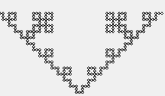

# KochCurve-LSystem-P5js
A Koch curve generator implemented in JavaScript using P5.js
This idea was inspired by the book **"Procedural Content Generation in Games"**, chapter 5 "Grammars and L-systems with application to vegetation and levels"

## Instructions
If you want to modify any data, plase use the *config.js* file.

- `CNV_HEIGHT` and `CNV_WIDTH` are the canva dimensions for P5.js
- `PACE` counts how many pixels there are in each edge of the picture (how many pixels it will "jump" from node to node)
- `L_SYSTEM_LEFT` and `L_SYSTEM_RIGHT` are the rules the algorithm will used. Please, read more information about that bellow
- `SEED` is the initial value to be transformed by the rules
- `INITIAL_X` and `INITIAL_Y` are the coordinates of the first point of the curve
- `EXPANSIONS` is the number of iterations the algorithm will execute in order to generate the image

**How to use L-system variables**
First, you should know I've adopted the same alphabet from the book:
> **f** -> move forward
> **+** -> turn 90 degrees left
> **-** -> turn 90 degrees right

Consider A,B,C,D as statements and the following L-system:
A -> B
C -> D
You should rewrite the variables as:
`L_SYSTEM_LEFT = [A, C]`
`L_SYSTEM_LRIGHT = [B, D]`

Consider writing the rules sorted by hierarchy if necessary.

**How to see the image**
Open the *index.html* file in a local server